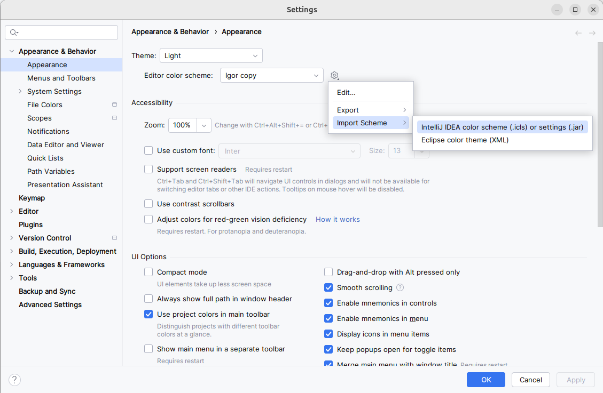
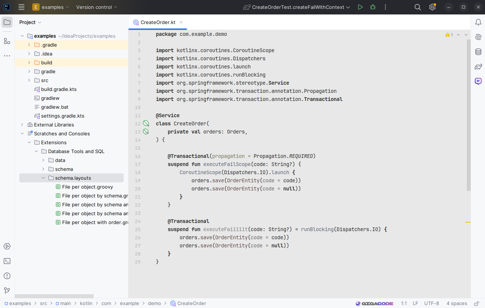

## IntelliJ IDEA almost monochrome scheme "Hippo"

### How to install:
1) Download file `src/Hippo.icls`.
2) Import scheme in IntelliJ IDEA:

Settings... / Appearance & Behavior / Appearance / Editor color scheme / Import Scheme / IntelliJ IDEA color scheme (.icls)...

